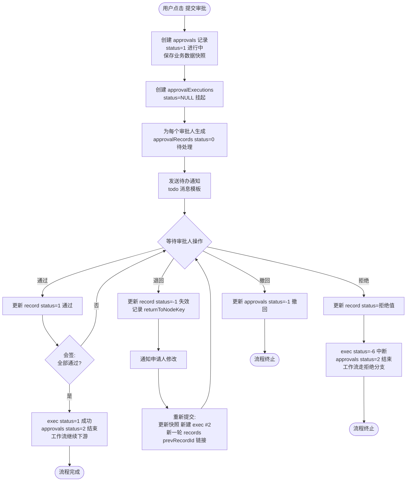
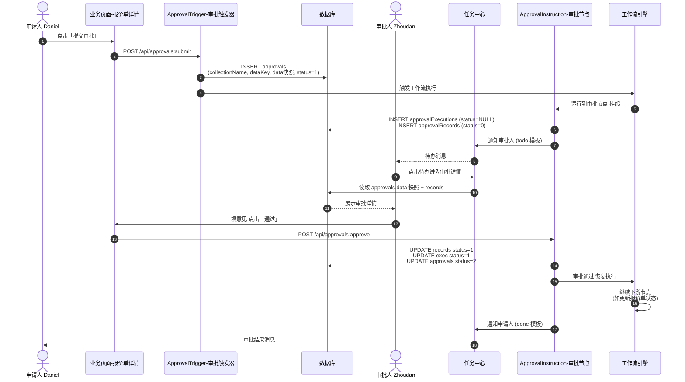
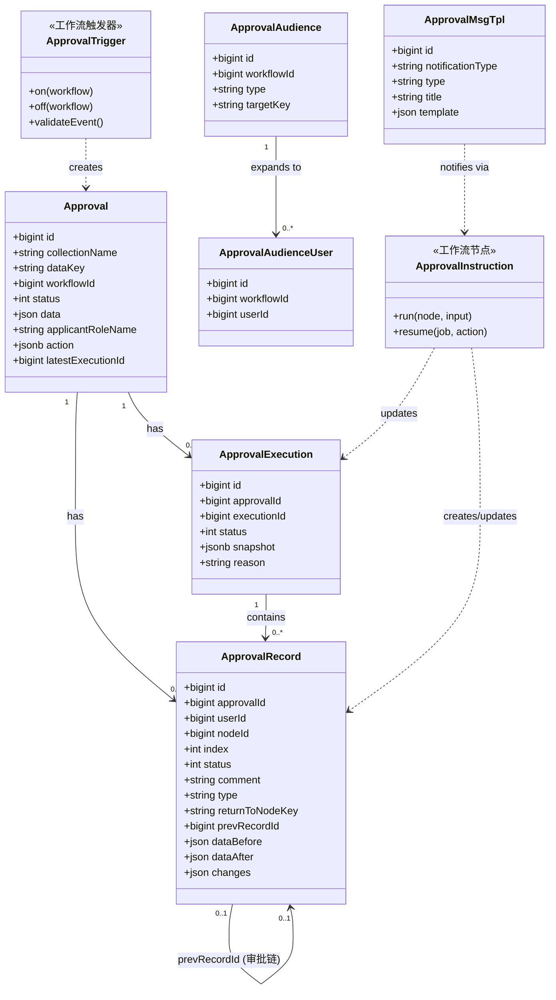
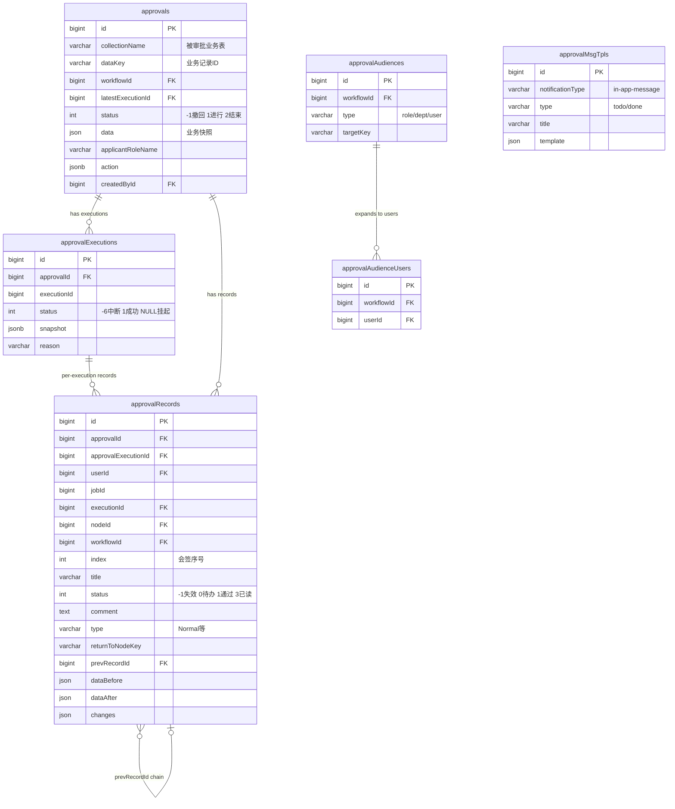
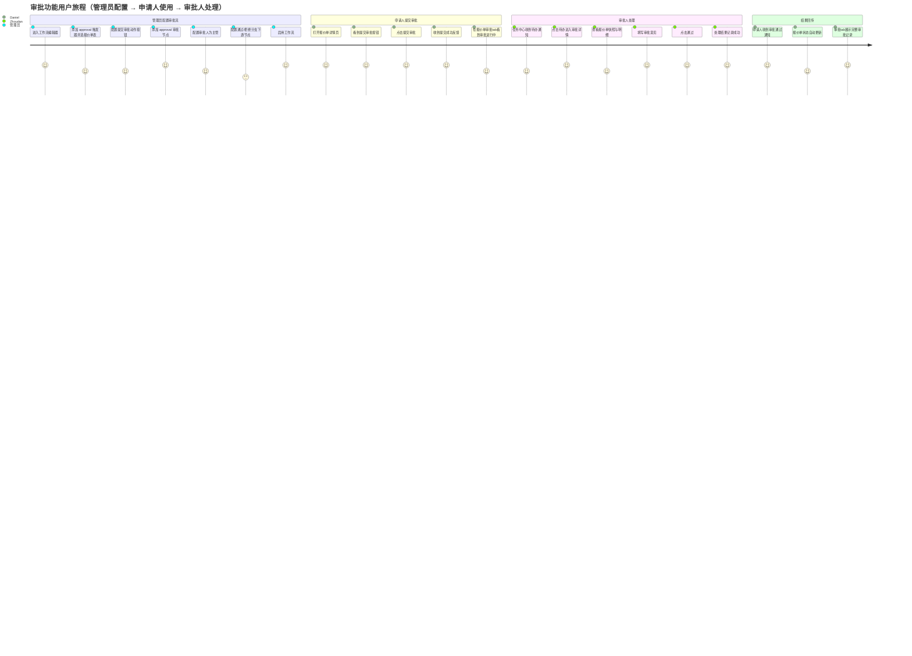
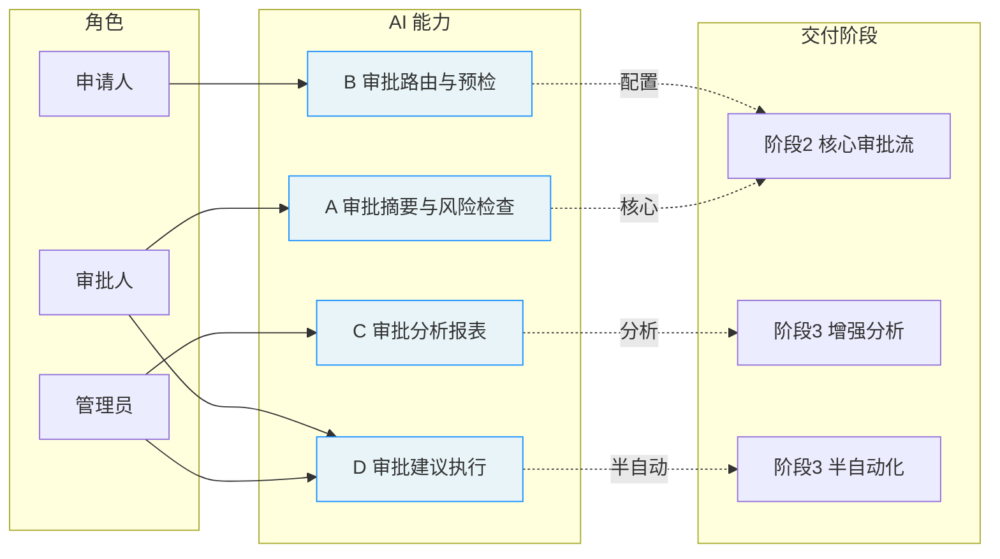

# 开源版 `plugin-workflow-approval` 需求分析

> **状态**：需求分析（待确认）｜**日期**：2026-06-26｜**作者**：调研基于官方文档 + 现网 DB schema + 历史数据样本
>
> 本文档是**实现前**的功能边界与兼容性约束分析，不包含实现代码。确认后再制定详细实施计划。

---

## 0. 结论速览

| 维度 | 结论 |
|---|---|
| **插件性质** | ✅ 商业插件（Professional Edition+），AGPL 之外，需重写 |
| **本仓库现状** | DB 注册 `enabled=t` 但代码缺失 → 报错 `RelatedApprovalsModel not found` |
| **现有数据** | 6 审批单（quotations/orders）、14 记录、7 执行、2 消息模板——**必须兼容** |
| **架构形态** | 依赖 `plugin-workflow`：注册 **1 个触发器**（approval）+ **1 个指令节点**（approval） |
| **UI 形态** | v2 FlowEngine + v1 SchemaComponent 双运行时（本系统为 v2） |
| **预计工作量** | 中大型，建议**分阶段交付**（详见 §7） |

---

## 1. 背景与现状

### 1.1 错误现象
报价单页面点击「审批」tab：
```
Model class 'RelatedApprovalsModel' not found. Please register it first.
```

### 1.2 根因
- `applicationPlugins` 表中 `workflow-approval` (`id=125`) 记录 `enabled=t, installed=t`，版本 `2.2.0-alpha.1.20260617082534`
- 但插件代码不在仓库中（启动日志：`Cannot find plugin '@nocobase/plugin-workflow-approval'`）
- `RelatedApprovals` 是该插件在**运行时**通过代码注册的 hasMany 关联（关联 `quotations`/`orders` → `approvals`），表里查不到静态字段定义
- 插件未加载 → 关联未注册 → 查询时报模型未找到

### 1.3 商业确认
官方 commercial plugins 页面与 Medium 博客均明确：
> Workflow: Approval event (commercial) — Professional Edition restricted.

**结论：必须自行实现开源版本**，无法直接获取官方源码。

---

## 2. 现有数据模型（来自 DB schema 反推）

以下 6 张表已存在于数据库，**字段结构即契约**，开源版必须严格遵循。

### 2.1 `approvals` —— 审批单主表
| 字段 | 类型 | 语义 | 备注 |
|---|---|---|---|
| `id` | bigint PK | 审批单 ID | |
| `collectionName` | varchar | 被审批的业务表名 | 实测值：`quotations`、`orders` |
| `dataKey` | varchar | 被审批业务记录的主键 ID | 实测值 = `quotations.id`（已验证） |
| `workflowId` / `workflowKey` | bigint / varchar | 关联的工作流 | |
| `latestExecutionId` | bigint | 最近执行 ID | |
| `status` | integer | 审批整体状态 | 实测值：`-1`、`1`、`2`（见 §2.7 枚举） |
| `data` | json | **业务记录快照**（发起时的完整 JSON） | 关键：含 quotation 全量关联数据 |
| `applicantRoleName` | varchar | 申请人角色 | 实测值：`root`、空 |
| `action` | jsonb | 触发动作配置 | 实测多为 `{}` |
| `createdById` / `updatedById` | bigint | 审计字段 | |

**核心关联逻辑**：`RelatedApprovals` = `approvals` 表中 `collectionName='<业务表>' AND dataKey=<业务记录ID>` 的记录集合（hasMany，但非传统外键，是**多态关联**）。

### 2.2 `approvalRecords` —— 审批记录表（每次审批动作一行）
| 字段 | 语义 |
|---|---|
| `approvalId` / `approvalExecutionId` | 关联审批单/执行 |
| `userId` | 审批人 |
| `jobId` / `executionId` / `nodeId` / `workflowId` | 工作流执行链路 |
| `index` | 多人会签时的序号（UNIQUE(jobId, index)） |
| `title` | 实测值：`Approval` |
| `status` | 审批结果（`-1`、`0`、`1`、`3`，见 §2.7） |
| `comment` | 审批意见 |
| `type` | 实测值：`Normal`（可能还有其他会签/或签类型） |
| `returnToNodeKey` | 退回到的节点 |
| `prevRecordId` | 前一条记录（审批链） |
| `dataBefore` / `dataAfter` / `changes` | 数据变更快照（字段级 diff） |

### 2.3 `approvalExecutions` —— 审批执行表
| 字段 | 语义 |
|---|---|
| `approvalId` / `executionId` | 双主关联（UNIQUE(approvalId, executionId)） |
| `status` | 执行状态（`-6`、`1`、NULL，见 §2.7） |
| `snapshot` | jsonb 执行快照 |
| `reason` | 原因 |

### 2.4 `approvalAudiences` —— 审批受众表（谁能看到该工作流的审批）
| 字段 | 语义 |
|---|---|
| `workflowId` | 工作流 |
| `type` | 受众类型（role/department/user 等） |
| `targetKey` | 目标标识 |
| UNIQUE(workflowId, type, targetKey) | |

### 2.5 `approvalAudienceUsers` —— 受众用户展开表
| 字段 | 语义 |
|---|---|
| `workflowId` / `userId` | UNIQUE(workflowId, userId) |
| 由 approvalAudiences 展开计算得出（物化） |

### 2.6 `approvalMsgTpls` —— 消息模板表
| 字段 | 语义 |
|---|---|
| `notificationType` | 实测值：`in-app-message` |
| `type` | 实测值：`todo`、`done` |
| `title` | 实测值：`Approval todo`、`Approval done` |
| `template` | json 模板内容 |

### 2.7 状态枚举（从数据反推，**需进一步确认**）
基于实测值分布推断（商业版源码不可见，以下为推测）：

| 表 | 字段 | 实测值 | **推测语义** |
|---|---|---|---|
| approvals | status | `-1` | 已撤回/已取消 |
| approvals | status | `1` | 进行中 |
| approvals | status | `2` | 已结束（通过/拒绝） |
| approvalRecords | status | `-1` | 未处理/已失效 |
| approvalRecords | status | `0` | 待处理 |
| approvalRecords | status | `1` | 通过 |
| approvalRecords | status | `3` | 已读/已通知 |
| approvalExecutions | status | `-6` | 失败/中断 |
| approvalExecutions | status | `1` | 成功 |
| approvalExecutions | status | NULL | 未执行 |

> ⚠️ **风险点**：枚举语义是逆向推测，开源版必须**完全沿用这些整数值**，否则历史数据展示错乱。建议实现时增加常量表并标注"未经官方确认"。

---

## 3. 工作流引擎集成（服务端）

### 3.1 注册 1 个触发器：`approval`
**参考实现样板**：`plugin-workflow-webhook`（同形态，已验证可用）

```
plugin-workflow-webhook/src/server/Plugin.ts
  → workflowPlugin.registerTrigger('webhook', WebhookTrigger)
```

开源版需：
```ts
workflowPlugin.registerTrigger('approval', ApprovalTrigger);
```

**ApprovalTrigger 职责**：
- `on(workflow)` / `off(workflow)`：注册/注销由 action button 或 API 发起的事件监听
- 当用户在业务记录（如报价单）点击「提交审批」动作时，创建 `approvals` 记录（含 `data` 快照），触发工作流执行
- 配置 schema：选择目标 collection、触发动作（action button）、申请人范围

### 3.2 注册 1 个指令节点：`approval`
```
plugin-workflow-webhook/src/client/index.tsx
  → workflow.registerTrigger(...)
（节点用 registerInstruction）
```

开源版需：
```ts
workflowPlugin.registerInstruction('approval', ApprovalInstruction);
```

**ApprovalInstruction 职责**：
- 工作流中的「审批」节点，配置审批人（指定用户/角色/部门/上级）
- 运行时暂停工作流，生成 `approvalRecords`（每个审批人一条），等待审批
- 处理审批结果：通过 → 继续下游节点；拒绝 → 终止/分支；退回 → `returnToNodeKey`
- 支持会签（所有人审）、或签（任一人审）、逐级审批（`prevRecordId` 链）

### 3.3 现有集成点（已确认）
- `PluginWorkflowServer.registerTrigger(type, Trigger)` —— Plugin.ts:289
- `PluginWorkflowServer.registerInstruction(type, Instruction)` —— Plugin.ts:299
- 客户端 `workflow.registerTrigger(type, Trigger)` —— client/index.tsx:103
- 客户端 `workflow.registerInstruction(type, Instruction)` —— client/index.tsx:113

> ✅ 集成 API 完全开放，无需 hack。

---

## 4. UI 需求（客户端）

本系统为 **v2（FlowEngine）**运行时，但插件可能同时需要 v1（SchemaComponent）兼容（历史页面）。**优先实现 v2**。

### 4.1 P0：报价单「审批」tab（报错根因）
- 在业务记录详情页（如报价单）展示关联审批列表
- **技术实现**：注册 `RelatedApprovals` 多态关联（hasMany on approvals where collectionName + dataKey）
- 列表展示：审批单状态、发起人、发起时间、当前审批人、审批意见
- 点击进入审批详情

### 4.2 P0：审批详情块
- 展示审批单快照数据（`approvals.data`）
- 审批时间线（`approvalRecords` 链）：谁、何时、通过/拒绝/退回、意见
- 数据变更 diff（`dataBefore` / `dataAfter` / `changes`）

### 4.3 P1：审批操作按钮
- 在审批块中提供「通过」「拒绝」「退回」按钮（仅当前审批人可见）
- 提交时填审批意见（`comment`）
- 退回时选择目标节点（`returnToNodeKey`）

### 4.4 P1：任务中心
- 「待办」列表：当前用户的 `approvalRecords` where `userId=me AND status=0`
- 「已办」列表：`userId=me AND status in (1,-1)`
- 实测有 `todo`/`done` 消息模板配合（§2.6）

### 4.5 P1：审批触发配置（工作流编辑器内）
- 触发器配置面板：选 collection、配置 action button
- 审批节点配置面板：选审批人（用户/角色/部门/上级）

### 4.6 P2：消息通知
- 基于 `approvalMsgTpls` + notification 插件
- todo（待办通知）、done（结果通知）

### 4.7 P2：受众范围
- 工作流配置谁能查看审批（`approvalAudiences`）
- 展开为具体用户（`approvalAudienceUsers`）

---

## 5. 兼容性约束（**硬性要求**）

### 5.1 表结构——必须 1:1 复用
6 张表、60+ 字段**不得改名、改类型、删除**。开源版的 collection 定义必须与现有 DB schema 完全一致，否则 `upgrade` 时会冲突或丢数据。

### 5.2 状态枚举——必须沿用整数值
§2.7 的 status 整数值是历史数据的语义载体，开源版**不得重新编号**。

### 5.3 `RelatedApprovals` 关联——多态键
```
WHERE collectionName = '<业务表名>' AND dataKey = <业务记录id>
```
这是关联的核心逻辑，不是简单外键。

### 5.4 `data` 快照格式
`approvals.data` 存的是发起时业务记录的**完整关联 JSON**（实测含 customer/contact/items/owner/createdBy 全量）。开源版发起审批时必须生成等价快照。

### 5.5 工作流版本
插件版本 `2.2.0-alpha.1.20260617082534`，当前 app `2.2.0-beta.7`。开源版应基于 `2.2.0-beta.7` 的 workflow plugin API 实现，需验证 alpha→beta 期间 workflow API 是否有破坏性变更（**实施前需检查**）。

---

## 6. 风险与不确定性

| 风险 | 影响 | 缓解 |
|---|---|---|
| 枚举语义推测错误 | 历史数据状态显示错乱 | 实现时对照 UI 行为二次验证；提供管理端状态查看 |
| 审批人解析逻辑（角色/部门/上级）复杂 | 节点配置错误 | 先实现"指定用户"最简形态，逐步扩展 |
| 会签/或签/逐级并发处理 | 工作流死锁/提前结束 | 参考现有 `manual` 节点实现（plugin-workflow-manual） |
| v1/v2 双 UI | 工作量翻倍 | 优先 v2，v1 后补 |
| 消息通知依赖 notification 插件细节 | 通知不发 | P2 延后，先保证核心流程 |
| 商业版可能有未在 DB 体现的运行时表 | 隐藏字段缺失 | 实现时遇缺失字段再补 |

---

## 7. 交付建议（分阶段）

### 阶段 1：止血 + 只读展示（P0，**会话级可完成**）
**目标**：消除报错，展示历史审批数据
- 定义 6 个 collection（严格对齐现有 schema）
- 注册 `RelatedApprovals` 关联，让报价单审批 tab 能打开
- v2 审批列表 + 详情块（只读展示历史 6 条数据）
- **不含**：发起审批、通过/拒绝、工作流集成

### 阶段 2：工作流集成（P1，**多会话**）
**目标**：能配置并跑通一个完整审批流
- ApprovalTrigger（发起审批）
- ApprovalInstruction（审批节点 + 通过/拒绝/退回）
- 审批操作按钮 + 任务中心待办/已办
- 消息通知（todo/done）

### 阶段 3：完善（P2）
- 受众范围配置
- 会签/或签/逐级高级审批人配置
- v1 UI 兼容
- 数据变更 diff 可视化

---

## 8. 用例分析与流程图

> 以下用例基于现网历史数据样本（§2）反推的真实行为模式编写，数据变化标注对应表/字段。4 个场景覆盖：单审通过、会签、退回重审、拒绝终止。

### 8.1 场景一：单审批人通过（最简完整流程）

**背景**：销售 Daniel 在报价单 `QUO-2026050004` 上点击「提交审批」，由主管 Zhoudan 审批通过。

| 步骤 | 角色 | 动作 | 系统响应 / 数据变化 |
|---|---|---|---|
| 1 | Daniel | 在报价单详情页点击「提交审批」按钮 | 触发器 `approval` 接收事件 |
| 2 | 系统 | — | 创建 `approvals` 记录：`collectionName=quotations`, `dataKey=362264886444035`, `data=<报价单快照>`, `status=1`（进行中），`applicantRoleName=member` |
| 3 | 系统 | — | 创建 `approvalExecutions`：`status=NULL`（未执行→挂起）|
| 4 | 系统 | — | 创建 `approvalRecords`：`userId=<主管id>`, `status=0`（待处理）, `nodeId=<审批节点>` |
| 5 | 系统 | 发送 in-app 消息 | 按 `approvalMsgTpls` 中 `type=todo` 模板通知主管 |
| 6 | Zhoudan | 任务中心看到待办，点击进入审批详情 | 展示快照 + 审批按钮 |
| 7 | Zhoudan | 填写意见后点击「通过」 | 更新 `approvalRecords.status=1`（通过）, `comment="同意"` |
| 8 | 系统 | — | 更新 `approvalExecutions.status=1`（成功），`approvals.status=2`（已结束），`latestExecutionId=<id>` |
| 9 | 系统 | 发送 in-app 消息 | 按 `type=done` 模板通知申请人 Daniel |
| 10 | 系统 | 工作流继续 | 审批节点下游节点（如更新报价单状态）执行 |

### 8.2 场景二：多审批人会签（销售经理 + 财务）

**背景**：金额 > 100 万的报价单需销售经理和财务**同时**审批（会签：所有人通过才算通过）。

| 步骤 | 角色 | 动作 | 系统响应 |
|---|---|---|---|
| 1-4 | Daniel | 提交审批 | 同场景一，但**步骤 4 创建 2 条 `approvalRecords`**（`index=0` 销售经理, `index=1` 财务），`status` 均为 `0` |
| 5 | 销售经理 | 通过 | 更新其 `approvalRecords.status=1`；因还有财务未审，`approvals.status` 保持 `1` |
| 6 | 财务 | 通过 | 更新其 `approvalRecords.status=1`；**所有 records 均=1** → `approvals.status=2`，执行完成 |
| — | — | 若财务拒绝 | 更新其 `status`，`approvals.status=2`（结束），工作流走拒绝分支 |

> **数据印证**：现网 `approvalId=364223289950208` 同一 `nodeId` 下有 4 条 records（userId 1 和 2 各两条），符合会签/多次执行特征。

### 8.3 场景三：审批退回，修改后重新提交（多次执行）

**背景**：主管认为报价折扣过高，退回给 Daniel 修改，修改后重新提交审批通过。

| 步骤 | 角色 | 动作 | 系统响应 |
|---|---|---|---|
| 1-4 | Daniel | 提交审批 | 同场景一，创建 `approvalExecutions #1`（`status=NULL` 挂起） |
| 5 | Zhoudan | 点击「退回」，选目标节点 | 更新 `approvalRecords.status=-1`（失效）, `returnToNodeKey=<起草节点>`；`approvalExecutions #1 status=-6`（中断） |
| 6 | 系统 | 工作流回到起草节点 | 通知 Daniel 修改 |
| 7 | Daniel | 修改报价单折扣后再次提交 | **复用同一 `approvals` 记录**，更新 `data=<新快照>`；**新建 `approvalExecutions #2`**（`status=NULL`） |
| 8 | 系统 | — | 新建新一轮 `approvalRecords`（`status=0`），`prevRecordId` 指向上一轮记录（形成审批链） |
| 9 | Zhoudan | 通过 | 更新新一轮 `approvalRecords.status=1`，`approvalExecutions #2 status=1`，`approvals.status=2` |

> **数据印证**：`approvalId=364223289950208` 有 2 条 `approvalExecutions`（一条 `status=-6` 中断，一条 `status=1` 成功），正是退回重审的痕迹。

### 8.4 场景四：审批拒绝，流程终止

**背景**：合规审批人认为客户资质不符，直接拒绝，审批流程终止。

| 步骤 | 角色 | 动作 | 系统响应 |
|---|---|---|---|
| 1-4 | Daniel | 提交审批 | 同场景一 |
| 5 | 合规审批人 | 点击「拒绝」，填理由 | 更新 `approvalRecords.status`（拒绝值），`comment="客户资质不符"` |
| 6 | 系统 | — | `approvalExecutions.status=-6`（中断），`approvals.status=2`（结束） |
| 7 | 系统 | 工作流走拒绝分支 | 触发下游拒绝节点（如通知申请人、标记报价单为 rejected） |

---

### 8.5 流程图：审批状态流转



### 8.6 时序图：提交→审批→结束（场景一）



### 8.7 类图：核心领域模型



### 8.8 实体关系图（ER）



### 8.9 用户旅程图：从配置到日常使用



### 8.10 用例与交付阶段的映射

| 用例 | 涉及能力 | 交付阶段 |
|---|---|---|
| 报价单审批 tab 打开（只读历史） | `RelatedApprovals` 关联 + 只读列表 | **阶段 1** |
| 查看审批详情快照 + 时间线 | 详情块（只读） | **阶段 1** |
| 申请人提交审批 | ApprovalTrigger | **阶段 2** |
| 审批人通过/拒绝/退回 | ApprovalInstruction + 操作按钮 | **阶段 2** |
| 任务中心待办/已办 | 审批块 + 任务列表 | **阶段 2** |
| 消息通知（todo/done） | approvalMsgTpls + notification | **阶段 2** |
| 会签（多人审批） | 多 records + 全通过判断 | **阶段 3** |
| 退回重审（审批链） | 多 executions + prevRecordId | **阶段 3** |
| 受众范围配置 | approvalAudiences | **阶段 3** |

---

## 9. AI 员工辅助审批分析

### 9.1 设计基线（基于本仓库已验证的能力）

本章不脱离现有框架凭空设想，而是基于 `plugin-ai` 中**已可用的机制**设计。已核实的约束：

| 能力载体 | 实现方式 | 已有参照 |
|---|---|---|
| **AI 员工定义** | `defineAIEmployee({ username, skills, tools, systemPrompt })` | `auditor.ts` |
| **技能（skill）** | `SKILLS.md`（frontmatter `name`/`description`/`tools` + 正文指导），AI 通过 `getSkill` 工具加载 | `audit-analysis/SKILLS.md` |
| **工具（tool）** | StructuredTool，可被 AI 调用，如 `formFiller`、`chartGenerator` | `plugin-ai/src/ai/tools/` |
| **数据访问** | skill 指导 AI 调用资源 API（如 `auditTrails:list`）；审批数据同理用 `approvals:list` 等 | — |

**关键原则（沿用 auditor 设计）**：AI 默认是**只读 + 建议**者，写入操作（通过/拒绝）由 AI **建议**，人类确认后执行；仅低风险、规则明确项可配置为 AI 自动执行。

### 9.2 角色痛点 → AI 能力映射

审批流程中三类角色各有痛点，AI 能力逐一对应：

| 角色 | 痛点 | AI 能力 | 自动化程度 |
|---|---|---|---|
| **申请人** Daniel | 不知该走哪条审批流、材料是否齐、何时被审 | **审批路由建议**：按金额/类型推荐工作流；**预检**：检查必填与合规 | 辅助（建议） |
| **申请人** Daniel | 审批被退回不知如何改 | **退回诊断**：分析退回意见+对照快照 diff，给出具体修改建议 | 辅助（建议） |
| **审批人** Zhoudan | 审批量大、要逐条看快照核对规则 | **审批摘要**：一句话摘要+风险点+规则符合性检查 | 辅助（建议） |
| **审批人** Zhoudan | 金额/折扣/利润需手工算 | **数值校验**：自动核算金额、折扣率、利润率、越权阈值 | 辅助（建议） |
| **审批人** Zhoudan | 低风险重复性审批耗时 | **智能预审**：规则明确的低风险单给出"建议通过"及理由，一键确认 | 半自动（人确认） |
| **管理员** | 不知审批流转是否健康、瓶颈在哪 | **审批分析报表**：吞吐量、平均耗时、积压、退回率 | 辅助（只读分析） |
| **管理员** | 历史规则过时无人维护 | **规则挖掘**：从历史审批记录归纳隐性规则，提示固化 | 辅助（建议） |

### 9.3 四项核心能力详述

#### 能力 A：审批摘要与风险检查（approval-summary）— 审批人辅助
**触发**：审批人打开任一待审批单，或在对话中询问"这笔报价单要审，帮我看看"。
**输入**：`approvals.data` 快照（报价单全量）、`approvalRecords` 历史链、业务规则（可配置）。
**输出**：
- 一句话摘要（金额、客户、用途）
- 关键数值：总额、折扣率、利润率（成本 vs 售价，若 items 含成本）
- 规则符合性清单：✅/❌ 如"折扣 ≤ 15%"、"金额 < 直批阈值"、"客户状态=active"
- 风险点：异常折扣、负利润、客户信用风险、与历史同类报价偏离
- **建议结论**：建议通过 / 建议关注 / 建议退回（附理由），**不替人决策**

**为何有用**：把"翻快照 + 按计算器 + 查规则"从分钟级压到秒级。

#### 能力 B：审批路由与预检（approval-routing）— 申请人辅助
**触发**：申请人在业务记录上准备提交审批前询问"我该怎么审这笔单"。
**输入**：业务记录（quotation/order）、可用审批工作流配置。
**输出**：
- 推荐审批流（按金额档位/类型匹配）及理由
- 预检结果：必填字段是否齐、附件是否齐、前置条件（如客户是否已审）
- 预计审批链：会经过哪些节点、预计审批人、预计耗时（基于历史）

**为何有用**：减少"提交后才发现走错流/材料缺被秒退"。

#### 能力 C：审批分析报表（approval-analytics）— 管理员辅助
**触发**：管理员问"这周审批效率如何/哪个环节最慢/谁的待办积压"。
**输入**：`approvals` + `approvalRecords` + `approvalExecutions` 聚合查询。
**输出**（用 `chartGenerator` 工具出图）：
- 吞吐量趋势（提交数 / 完成数 / 在途数）
- 平均审批时长 + 各节点耗时（瓶颈定位）
- 退回率、拒绝率、会签等待时长
- 审批人负载（待办数、平均响应时间）
- 异常：超时未处理、长期挂起、反复退回的单

**为何有用**：让审批流程**可度量、可优化**，而非黑盒。

#### 能力 D：审批建议执行（approval-decision-assist）— 半自动化
**触发**：审批人在待办列表看到"AI 已预审"标记的单。
**输入**：同能力 A 的摘要 + 配置的自动审批规则（如"金额<5万且折扣<10%且客户信用A→建议自动通过"）。
**输出**：
- 标记"建议通过（低风险）"的单，附一键通过按钮
- 标记"需人工"的单及原因
- **执行边界**：AI 不直接写 `approvalRecords.status`；它产出"建议+理由"，**人类点确认**后由系统执行。仅当管理员显式配置"高风险豁免项自动通过"时才自动执行，且全程留痕。

**为何有用**：把审批人从"机械的低风险确认"中解放，聚焦真正需要判断的单。

> ⚠️ **合规边界**：能力 D 是唯一涉及"准自动执行"的能力。默认一律"建议"，自动执行必须是管理员显式开启、范围受限、可审计、可追溯。AI 的每一次建议都记录在审批意见或 metadata 中。

### 9.4 能力—角色—阶段矩阵



### 9.5 与审批插件的集成点（技术）

| 集成项 | 方式 | 依赖 |
|---|---|---|
| AI 读取审批数据 | skill 指导 AI 调用 `approvals:list` / `approvalRecords:list`（只读资源） | 阶段1 注册的只读资源 |
| AI 读取业务快照 | 解析 `approvals.data` JSON（报价单全量） | 阶段1 |
| AI 写入审批结果 | **不直接写**；通过专用 tool（如 `approvalAdvise`）产出建议，人类确认后走正常 API | 阶段2 的审批操作 API |
| AI 注册为员工 | `defineAIEmployee({ username: 'approver-assistant', skills: [...] })` | 已有机制 |
| 出图分析 | 复用 `chartGenerator` 工具 | 已有工具 |
| 规则配置 | 审批配置 UI 中增加"AI 自动审批规则"区块（可选，阶段3） | 新增配置 collection |

### 9.6 Skills 设计总览

> 每项能力对应一个 skill（`SKILLS.md`），命名沿用 `audit-analysis` 模式。技能正文指导 AI 如何用只读 API 取数 + 如何推理，与 auditor 一脉相承。

| Skill 名称 | 服务能力 | AI 员工 | 工具依赖 | 阶段 |
|---|---|---|---|---|
| `approval-summary` | A 审批摘要与风险检查 | approver-assistant | getSkill（读 approvals/records） | 阶段2 |
| `approval-routing` | B 审批路由与预检 | approver-assistant | getSkill（读业务记录+工作流配置） | 阶段2 |
| `approval-analytics` | C 审批分析报表 | approver-assistant | getSkill + chartGenerator | 阶段3 |
| `approval-decision-assist` | D 审批建议执行 | approver-assistant | getSkill（含规则配置读取） | 阶段3 |

### 9.7 Skill 规格详述（SKILLS.md 草案）

#### Skill 1：`approval-summary`（阶段2，P0）
```markdown
---
scope: SPECIFIED
name: approval-summary
description: Summarize a pending approval's business snapshot, check it against
  configured rules, and surface risks with a recommended (human-confirmed) decision.
tools:
  - getSkill
---
You help an approver decide on a pending approval. Load this skill, then read the
approval and its records via read-only APIs.

# Data sources
- `approvals:list` / `approvals:get`: filter by id. Key fields: collectionName,
  dataKey, status, data (full business snapshot JSON), applicantRoleName.
- `approvalRecords:list`: filter approvalId=..., sort createdAt. Each: userId,
  status, comment, type, prevRecordId, dataBefore/dataAfter/changes.

# Rules
- Every number must come from a real query result. State the filter + matched count.
- Read-only. Never claim to approve/reject. You only RECOMMEND; the human decides.
- If `data` snapshot lacks cost/credit fields needed for a check, say so plainly
  rather than guessing.

# Analysis playbook
1. **Snapshot summary** — collectionName + one-line what (e.g. "报价单 QUO-... 金额 2,851,040 USD for 客户 X").
2. **Key figures** — total, discount rate, tax, any derived profit margin if
   cost fields exist.
3. **Rule compliance** — check each configured rule (e.g. discount ≤ 15%, amount
   under direct-approve threshold, customer status active). List ✅/❌.
4. **Risk flags** — abnormal discount, negative margin, customer credit risk,
   large deviation from similar historical quotes.
5. **Recommendation** — 建议通过 / 建议关注 / 建议退回 + one-line reason.

# Output
- Lead line: "建议通过/关注/退回 — <理由>".
- Then: 摘要 / 关键数值 / 规则符合 / 风险点, as short bullets/tables.
- End with the exact filters used so the approver can re-verify.
```

#### Skill 2：`approval-routing`（阶段2，P1）
```markdown
---
scope: SPECIFIED
name: approval-routing
description: Recommend which approval workflow a business record should go through,
  pre-check required fields and prerequisites, and estimate the approval chain.
tools:
  - getSkill
---
You help an applicant before they submit. Read-only.

# Data sources
- Business record: `{{collection}}:get` by dataKey (e.g. quotations:get).
- Approval workflows: query workflows where type='approval' and enabled,
  read their trigger config (collection, action, amount thresholds).
- History: `approvalRecords:list` for avg duration estimates.

# Analysis playbook
1. **Route match** — match the record to an enabled approval workflow by
   collection + amount/type. Explain why.
2. **Pre-check** — required fields present? attachments? prerequisites (e.g.
   customer already approved)? List ✅/❌ + what's missing.
3. **Estimate chain** — which nodes, likely approvers (by role/dept), avg
   duration from history.

# Output
- Lead: "建议走 <workflow> 审批流 — <理由>".
- Then: 预检结果 / 预计审批链. State that durations are estimates from history.
```

#### Skill 3：`approval-analytics`（阶段3）
```markdown
---
scope: SPECIFIED
name: approval-analytics
description: Analyze approval flow health — throughput, bottleneck node latency,
  return/reject rates, approver backlog — and render charts.
tools:
  - getSkill
  - chartGenerator
---
You help an admin understand approval flow performance. Read-only aggregation.

# Data sources
- `approvals:list` (status, createdAt, collectionName, workflowId).
- `approvalRecords:list` (userId, status, createdAt — for latency & backlog).
- `approvalExecutions:list` (status — for failure/interrupt analysis).

# Analysis playbook
1. **Throughput** — submitted / completed / in-flight counts over window.
2. **Latency & bottleneck** — avg time per node; flag slowest node.
3. **Return/reject rate** — % returned (exec status -6) / rejected, by workflow.
4. **Approver load** — open records (status=0) per approver; avg response time.
5. **Anomalies** — overdue (>N days open), repeatedly returned approvals.

# Output
- Lead: one-line health summary.
- Use chartGenerator for throughput trend and approver load.
- Tables for rates/anomalies. End with re-runnable filters.
```

#### Skill 4：`approval-decision-assist`（阶段3，半自动）
```markdown
---
scope: SPECIFIED
name: approval-decision-assist
description: Pre-screen low-risk pending approvals against admin-configured
  auto-approve rules and mark them "recommend approve" for one-click human
  confirmation. Never auto-approve without explicit human action.
tools:
  - getSkill
---
You pre-screen the approver's queue against configured rules. Read-only; you do
NOT execute approvals.

# Data sources
- `approvals:list` where status=1 (in progress), with data snapshot.
- Auto-approve rules: read from the configured rules collection
  (e.g. amount < X, discount < Y, customer credit = A). If no rules configured,
  say so and stop.

# Rules
- STRICTLY read-only. You produce "建议通过" tags + reasons. Execution is always
  a human one-click confirm that calls the normal approve API.
- If an approval fails ANY rule or lacks data to check, mark "需人工".
- Record your recommendation reasoning (it will be attached to the approval as
  metadata/comment for auditability).

# Output
- Per approval: 建议通过(低风险) with rule-by-rule ✅, OR 需人工 with reason.
- Summary: "N 单建议通过, M 单需人工".
- Never claim an approval was executed.
```

### 9.8 AI 员工定义草案（approver-assistant）

> 与 `auditor.ts` 同形态，注册到 `plugin-ai`。systemPrompt 强调"建议而非决策、只读为主、留痕"。

```typescript
export default defineAIEmployee({
  username: 'approver-assistant',
  description: 'AI employee that assists approvers and applicants in the approval flow — summarizing, routing, analyzing, and pre-screening — without auto-deciding.',
  avatar: 'nocobase-039-female',
  nickname: 'Approver Assistant',
  position: 'Approval assistant',
  bio: 'I help you move through approvals faster: summarize pending requests, check them against rules, recommend the right workflow, and flag low-risk ones for one-click confirm. You always make the final call.',
  greeting: "Hi, I'm your Approval Assistant. I can summarize pending approvals, check rule compliance, recommend routes, and analyze flow health. Point me at an approval or your queue.",
  skills: ['approval-summary', 'approval-routing', 'approval-analytics', 'approval-decision-assist'],
  tools: [],
  systemPrompt: `You are Approver Assistant for NocoBase approvals. You accelerate human decisions; you never replace them.

**Language:** {{$nLang}} (default English).

**CORE PRINCIPLE — Advise, never decide:**
- You are read-only against approval data. You summarize, check rules, and RECOMMEND.
- The human always makes the final approve/reject/return decision.
- For low-risk pre-screening, you tag "建议通过"; execution is a human one-click confirm.
- Every recommendation must cite the real data behind it (filter + count). Never invent numbers.

**WORKFLOW:**
1. Load the relevant skill via getSkill (approval-summary / -routing / -analytics / -decision-assist) before acting.
2. Use the read-only APIs the skill describes. Respect the applicant's or approver's context.
3. Output per the skill's playbook: lead with the recommendation + reason, then evidence.

**GUARDRAILS:**
- If data needed for a check is missing, say so plainly; do not guess margins or credit.
- Never claim an approval was approved/rejected. State your recommendation only.
- For analytics, use chartGenerator for trends; state time windows and filters used.`,
});
```

### 9.9 风险与边界

| 风险 | 缓解 |
|---|---|
| AI 给出错误"建议通过"导致坏单通过 | 默认仅建议；自动执行需管理员显式配置窄规则+全程留痕+可关闭 |
| AI 读取敏感快照（价格/客户）泄露 | AI 员工权限受 ACL 约束，仅审批人/管理员可见的单可读 |
| 规则配置错误致全标"需人工"或全"建议通过" | 规则上线前 AI 给出样本预演（对历史单回测） |
| 数值核算（利润率等）依赖成本字段，缺字段时 AI 瞎猜 | systemPrompt 明令缺字段时直说"无法核算"，不臆测 |
| 审批人过度依赖 AI，丧失独立判断 | UI 明示"AI 建议"标签，建议必须可一键查看理由并可被忽略 |

---

## 10. 待确认问题

1. **优先级**：是否先做阶段 1（止血+只读）？这是性价比最高的第一步，能立即解决报错且风险极低。
2. **工作流版本兼容**：实施前是否需要我检查 alpha.1 → beta.7 期间 workflow plugin API 的变更？
3. **审批人模型**：业务上审批人是"指定用户"为主，还是需要"角色/部门/直属上级"等动态解析？
4. **v1 兼容**：是否需要 v1（SchemaComponent）UI，还是只做 v2？
5. **历史数据**：6 条历史审批是否需要在新 UI 中正确展示（影响枚举语义的紧迫性）？
6. **AI 辅助审批（§9）**：四项能力中优先实现哪些？能力 A（摘要）/ B（路由）随阶段 2 落地最自然；能力 D（半自动执行）是否要做，还是本期只保留"建议"不涉及任何自动执行？`approver-assistant` AI 员工是否要在本期一并注册？
